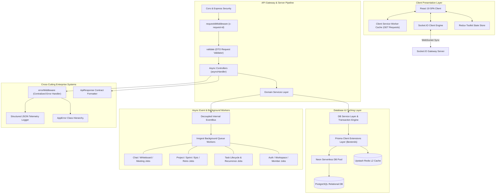
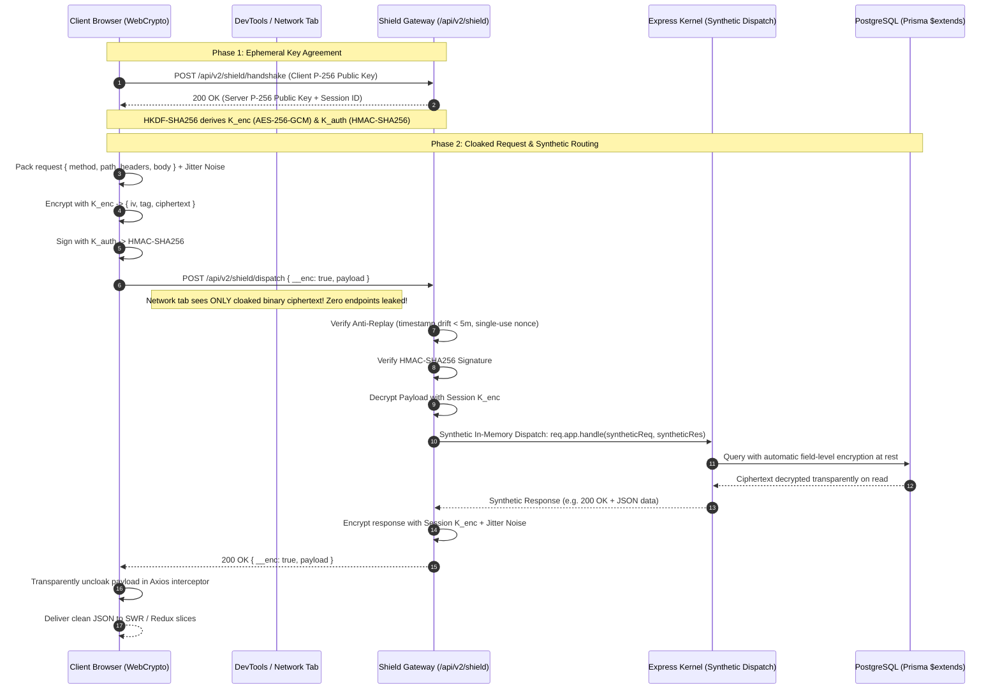

# 🏗️ Syncro Enterprise Architecture & Database Documentation

Welcome to the comprehensive technical architecture specification for **Syncro**. This document provides an in-depth breakdown of the system design, domain-driven clean architecture, database infrastructure, caching strategies, real-time engines, and security mechanics powering the platform.

> For the authentication/session model, CSRF, authorization, dependency-audit policy, and the running audit history, see [`SECURITY.md`](./SECURITY.md).

---

## 📑 Table of Contents
1. [High-Level System Overview](#-high-level-system-overview)
2. [Clean Hexagonal Architecture](#-clean-hexagonal-architecture)
3. [Complete Database Architecture & Mechanics](#-complete-database-architecture--mechanics)
   - [3.1 Relational Data Models & Schema Design](#31-relational-data-models--schema-design)
   - [3.2 Composite Multi-Column Indexing Strategy](#32-composite-multi-column-indexing-strategy)
   - [3.3 Prisma Client Extensions ($extends) & Field-Level Data-at-Rest Encryption](#33-prisma-client-extensions-extends--field-level-data-at-rest-encryption)
   - [3.4 Resilient Transaction Retry Engine](#34-resilient-transaction-retry-engine)
   - [3.5 Real-Time Database Health Monitoring](#35-real-time-database-health-monitoring)
   - [3.6 Soft Delete & Audit Logging Engine](#36-soft-delete--audit-logging-engine)
   - [3.7 L2 Redis Read-Through Caching Layer](#37-l2-redis-read-through-caching-layer)
   - [3.8 Enterprise Multi-Tenant Seed Pipeline](#38-enterprise-multi-tenant-seed-pipeline)
4. [Enterprise Cross-Cutting Concerns](#-enterprise-cross-cutting-concerns)
   - [4.1 AppError Hierarchy](#41-apperror-hierarchy)
   - [4.2 Unified API Response Contract & Client Unwrapping](#42-unified-api-response-contract--client-unwrapping)
   - [4.3 Async Exception Isolation](#43-async-exception-isolation)
   - [4.4 Request Correlation Tracing & JSON Telemetry](#44-request-correlation-tracing--json-telemetry)
   - [4.5 DTO Request Validation Pipeline](#45-dto-request-validation-pipeline)
5. [Real-Time Socket.IO & Event Bus Pipelines](#-real-time-socketio--event-bus-pipelines)
6. [Automated Verification & Testing Architecture](#-automated-verification--testing-architecture)
7. [Zero-Trust Cryptographic Cloaking: Syncro Shield Engine](#-zero-trust-cryptographic-cloaking-syncro-shield-engine)
   - [7.1 Architecture & Threat Model](#71-architecture--threat-model)
   - [7.2 Ephemeral ECDH P-256 Key Exchange & HKDF-SHA256 Derivation](#72-ephemeral-ecdh-p-256-key-exchange--hkdf-sha256-derivation)
   - [7.3 Authenticated Payload Encryption (AES-256-GCM) with Jitter Padding](#73-authenticated-payload-encryption-aes-256-gcm-with-jitter-padding)
   - [7.4 Unified Ingress Cloaked Gateway & Synthetic Express In-Memory Routing](#74-unified-ingress-cloaked-gateway--synthetic-express-in-memory-routing)
   - [7.5 Cryptographic Anti-Replay Guard & Atomic Nonce Verification](#75-cryptographic-anti-replay-guard--atomic-nonce-verification)
   - [7.6 Database Field-Level Data-at-Rest Encryption](#76-database-field-level-data-at-rest-encryption)
8. [Route-Level Code-Splitting & Frontend Performance Architecture](#-route-level-code-splitting--frontend-performance-architecture)
   - [8.1 Vite Dynamic Chunking with React.lazy() and Suspense](#81-vite-dynamic-chunking-with-reactlazy-and-suspense)
   - [8.2 Production-Only PWA Service Worker Scoping](#82-production-only-pwa-service-worker-scoping)
   - [8.3 Bundle Reduction & Cold Boot Metrics](#83-bundle-reduction--cold-boot-metrics)

---

## 🏛️ High-Level System Overview

Syncro is built as a highly available, event-driven, multi-tenant enterprise application. The platform cleanly segregates client-side single page applications (SPA), real-time WebSocket state machines, REST gateway controllers, transactional event background processing, and relational database persistence layers.



---

## 🎯 Clean Hexagonal Architecture

The codebase adheres strictly to **Clean Hexagonal Architecture** and **Domain-Driven Design (DDD)**. Dependencies flow inward toward domain business logic, insulating core rules from HTTP transport details, database clients, or external vendors.

```text
server/
├── config/                 # Environment & Infrastructure configuration
│   ├── prisma.js           # Prisma Client with $extends middleware & findUnique soft-delete delegates
│   ├── redis.js            # Upstash Redis & in-memory fallback client
│   └── nodemailer.js       # SMTP Transporter instance
├── utils/                  # Cross-Cutting Infrastructure Utilities
│   ├── errors/             # Operational AppError Class Hierarchy
│   │   └── appError.js     # Base AppError & HTTP-specific subclasses
│   ├── logger/             # Structured JSON Telemetry Logger
│   │   └── logger.js       # Production JSON log formatter
│   ├── response/           # Unified API Response Formatter
│   │   └── apiResponse.js  # Standardized ApiResponse success/error contract
│   └── asyncHandler.js     # Async controller exception isolation wrapper
├── middlewares/            # Request Interceptor Middleware Pipeline
│   ├── authMiddleware.js   # JWT authentication resolver
│   ├── errorMiddleware.js  # Centralized global Express error handler
│   ├── rateLimiter.js      # Environment-aware rate limiter middleware
│   ├── requestIdMiddleware.js # Request correlation ID (x-request-id) tracing
│   └── validate.js         # DTO request payload validation interceptor
├── validators/             # Domain DTO Validation Schemas
│   └── authValidators.js   # Auth DTO validation schemas
├── services/               # Application & Business Domain Services
│   ├── db/                 # Database Repository & Resilience Layer
│   │   └── dbService.js    # Transaction engine, health probes, soft delete, L2 cache
│   ├── auditLogger.js      # Audit log recorder service
│   ├── eventBus.js         # Decoupled internal event emitter
│   └── googleCalendarService.js # Google OAuth and calendar sync service
├── controllers/            # HTTP Presentation Controllers (Domain grouped)
│   ├── auth/               # User registration, login, 2FA, profile (with dev mode helpers)
│   ├── workspace/          # Workspace onboarding, memberships, invites (optimized queries)
│   ├── project/            # Project lifecycle, stages, members
│   ├── task/               # Task management, dependencies, recurrence
│   ├── chat/               # Channels, messages, direct messaging
│   └── ...                 # Retros, Epics, Sprints, Milestones, Meetings
├── prisma/                 # Relational Schema & Seed Generator
│   ├── schema.prisma       # Prisma PostgreSQL models & composite indexes
│   └── seed.js             # Enterprise multi-tenant mock data seed generator
└── tests/                  # Automated Verification Suites
    ├── architecture.test.js# Clean Architecture & DTO test suite
    └── database.test.js    # Database health & transaction retry test suite
```

---

## 💾 Complete Database Architecture & Mechanics

### 3.1 Relational Data Models & Schema Design
The database architecture uses **PostgreSQL** managed through **Prisma ORM**. The data model supports multi-tenant isolation, workspace RBAC, agile project management, real-time messaging, Gantt schedules, Kanban boards, and security auditing.

Key Domain Entities:
- **`User`**: System identity, encrypted auth credentials, 2FA security codes, and Google OAuth tokens.
- **`Workspace`**: Tenant boundary owning projects, channels, portfolios, whiteboards, sub-teams, and audit logs.
- **`WorkspaceMember`**: Relational join table mapping users to workspaces with granular roles (`OWNER`, `ADMIN`, `MANAGER`, `MEMBER`).
- **`Project`**: Engineering workspace container with stages, milestones, sprints, epics, and tasks.
- **`Task`**: Core work item supporting statuses, priorities, types (`TASK`, `BUG`, `FEATURE`, `IMPROVEMENT`), assignees, dependencies, recurrence rules, and soft deletion (`deletedAt`).
- **`Channel` & `Message`**: Workspace communication streams supporting public/private channels, direct messages, message threads, and emoji reactions.
- **`Sprint` & `Epic`**: Agile Scrum sprint lifecycles, capacity tracking, retro columns (`RetroColumn`, `RetroItem`), and epic milestones.
- **`AuditLog`**: Security log capturing entity mutations with JSON state diffs and client IP/User-Agent telemetry.

---

### 3.2 Composite Multi-Column Indexing Strategy
To deliver sub-millisecond query execution on high-throughput database paths, multi-column composite indexes are defined across key models:

```prisma
model Task {
  // ... fields ...
  @@index([projectId, deletedAt, status, priority]) // High-performance Kanban board queries
  @@index([assigneeId, deletedAt, due_date])        // "My Tasks" query path
  @@index([sprintId, deletedAt])                   // Sprint task execution
  @@index([epicId, deletedAt])                     // Epic roadmap aggregations
  @@index([milestoneId])
  @@index([stageId])
}

model Message {
  // ... fields ...
  @@index([channelId, createdAt(sort: Desc), id])        // High-speed chat cursor pagination
  @@index([recipientId, userId, createdAt(sort: Desc)]) // Direct message timeline lookup
  @@index([userId])
  @@index([parentId])
}

model Project {
  // ... fields ...
  @@index([workspaceId, status, deletedAt]) // Workspace project listings
  @@index([team_lead, deletedAt])           // Team lead project lookup
}

model AuditLog {
  // ... fields ...
  @@index([workspaceId, createdAt(sort: Desc)]) // Workspace activity feed pagination
  @@index([entityType, entityId])               // Entity audit timeline lookups
  @@index([userId])
}

model Notification {
  // ... fields ...
  @@index([userId, isRead, createdAt(sort: Desc)]) // User unread inbox notification index
}

model WorkspaceMember {
  // ... fields ...
  @@index([workspaceId, userId, role]) // Authorization & RBAC lookups
}
```

---

### 3.3 Prisma Client Extensions (`$extends`) & Field-Level Data-at-Rest Encryption
In `server/config/prisma.js`, the base `PrismaClient` is enhanced with a transparent Prisma Client Extension layer (`$extends`):

1. **Automated Soft-Delete Interceptor**:
   Automatically intercepts `findMany`, `findFirst`, `findFirstOrThrow`, `count`, `aggregate`, and `groupBy` operations on soft-deletable models (`User`, `Workspace`, `Project`, `Task`). Injects `where.deletedAt = null` by default unless explicitly overridden in the query.
2. **`findUnique` & `findUniqueOrThrow` Soft-Delete Delegate**:
   Prisma Client strictly validates `where` input on `findUnique` queries and rejects non-unique filter keys such as `deletedAt`. The extension delegates `findUnique` and `findUniqueOrThrow` calls on soft-deletable models to `findFirst` / `findFirstOrThrow` with `deletedAt: null`, preserving transparent soft-delete filtering without triggering `PrismaClientValidationError`.
3. **Automated Field-Level Data-at-Rest Encryption**:
   Transparently intercepts write operations (`create`, `update`, `upsert`) to encrypt sensitive data before it reaches PostgreSQL, and decrypts it on read operations (`findMany`, `findFirst`, `findUnique`, relation includes):
   - **`User`**: `googleAccessToken`, `googleRefreshToken`, `twoFactorCode`
   - **`Message`**: `content` (Chat conversations & direct messages)
   - **`Comment`**: `content` (Task commentary threads)
   All ciphertext is stored with unique 96-bit initialization vectors and 128-bit authentication tags (`iv:tag:data`) using authenticated AES-256-GCM.
4. **Query Performance & Telemetry Diagnostics**:
   Measures query execution duration using `performance.now()`. Automatically logs structured slow query warnings whenever an operation exceeds `150ms`.

```javascript
export const prisma = basePrisma.$extends({
  name: 'EnterpriseDatabaseExtensions',
  query: {
    $allModels: {
      async $allOperations({ model, operation, args, query }) {
        const start = performance.now();

        // 1. Transparent write-time field encryption
        const writeOps = ['create', 'update', 'upsert'];
        if (writeOps.includes(operation) && model && ENCRYPTED_FIELDS_BY_MODEL[model]) {
          if (args.data) args.data = encryptModelData(model, args.data);
          if (args.create) args.create = encryptModelData(model, args.create);
          if (args.update) args.update = encryptModelData(model, args.update);
        }

        // 2. Soft-delete filter interceptor & findUnique delegate
        if (model && SOFT_DELETE_MODELS.has(model)) {
          args = args || {};
          args.where = args.where || {};

          if (operation === 'findUnique' || operation === 'findUniqueOrThrow') {
            const modelName = model.charAt(0).toLowerCase() + model.slice(1);
            const targetMethod = operation === 'findUnique' ? 'findFirst' : 'findFirstOrThrow';
            const where = { ...args.where };
            if (where.deletedAt === undefined) where.deletedAt = null;
            const rawResult = await basePrisma[modelName][targetMethod]({ ...args, where });
            return decryptResults(model, rawResult);
          }

          const readOps = ['findMany', 'findFirst', 'findFirstOrThrow', 'count', 'aggregate', 'groupBy'];
          if (readOps.includes(operation)) {
            if (args.where.deletedAt === undefined) args.where.deletedAt = null;
          }
        }

        // 3. Query execution
        const result = await query(args);
        const duration = performance.now() - start;

        // 4. Telemetry diagnostics
        if (duration >= SLOW_QUERY_THRESHOLD_MS) {
          console.warn(`[SLOW DB QUERY ALERT] Model: ${model || 'Raw'} | Operation: ${operation} | Duration: ${duration.toFixed(2)}ms`);
        }

        // 5. Transparent read-time field decryption (including nested relations)
        return decryptResults(model, result);
      },
    },
  },
});
```

---

### 3.4 Resilient Transaction Retry Engine
Multi-model database operations execute inside the transaction engine (`executeTransaction` in `server/services/db/dbService.js`). The engine automatically intercepts transient PostgreSQL deadlocks or serialization failures (PostgreSQL codes `40001` or `40P01`) and applies exponential backoff retries:

```javascript
export const executeTransaction = async (actionFn, options = {}) => {
  const { maxRetries = 3, timeout = 10000, isolationLevel } = options;
  let attempt = 0;

  while (attempt < maxRetries) {
    attempt++;
    try {
      return await basePrisma.$transaction(async (tx) => await actionFn(tx), {
        timeout,
        ...(isolationLevel ? { isolationLevel } : {}),
      });
    } catch (error) {
      const isTransient =
        error.code === 'P2034' ||
        error.code === '40001' ||
        error.code === '40P01' ||
        error.message?.includes('deadlock') ||
        error.message?.includes('serialization');

      if (isTransient && attempt < maxRetries) {
        const backoffMs = Math.pow(2, attempt) * 100 + Math.floor(Math.random() * 50);
        console.warn(`[TRANSACTION RETRY] Attempt ${attempt}/${maxRetries} failed (${error.code}). Retrying in ${backoffMs}ms...`);
        await new Promise((resolve) => setTimeout(resolve, backoffMs));
      } else {
        throw error;
      }
    }
  }
};
```

---

### 3.5 Real-Time Database Health Monitoring
The application exposes real-time database readiness and round-trip time (RTT) diagnostics via `checkDatabaseHealth()` in `server/services/db/dbService.js`. Executed live at `/health`, `/api/ping`, and `/api/health/db`:

```javascript
export const checkDatabaseHealth = async () => {
  const startMs = performance.now();
  try {
    await basePrisma.$queryRawUnsafe('SELECT 1;');
    const latencyMs = Math.round(performance.now() - startMs);

    return {
      status: 'HEALTHY',
      database: 'PostgreSQL',
      driver: 'Prisma Client (Enterprise)',
      latencyMs,
      timestamp: new Date().toISOString(),
      details: { ping: 'OK', slowQueryThresholdMs: 150 },
    };
  } catch (error) {
    const latencyMs = Math.round(performance.now() - startMs);
    return {
      status: 'UNHEALTHY',
      database: 'PostgreSQL',
      latencyMs,
      error: error.message,
      timestamp: new Date().toISOString(),
    };
  }
};
```

---

### 3.6 Soft Delete & Audit Logging Engine
Entity deletion executes via `softDeleteEntity(modelName, entityId, context)`, marking `deletedAt = new Date()` and atomically recording a `CRITICAL` severity audit log entry with state snapshots:

```javascript
export const softDeleteEntity = async (modelName, entityId, context = {}) => {
  const { workspaceId, userId, entityName = "", req } = context;

  return await executeTransaction(async (tx) => {
    const lowerModel = modelName.toLowerCase();
    const existing = await tx[lowerModel].findUnique({ where: { id: entityId } });
    if (!existing) throw new Error(`${modelName} with ID ${entityId} not found`);

    const updated = await tx[lowerModel].update({
      where: { id: entityId },
      data: { deletedAt: new Date() },
    });

    if (workspaceId && userId) {
      await logAuditEvent({
        workspaceId,
        userId,
        action: 'DELETE',
        entityType: modelName.toUpperCase(),
        entityId,
        entityName: entityName || existing.name || existing.title || entityId,
        severity: 'CRITICAL',
        previousState: existing,
        newState: updated,
        req,
      });
    }

    return updated;
  });
};
```

---

### 3.7 L2 Redis Read-Through Caching Layer
High-frequency queries (such as user workspace listings or role matrices) use the read-through L2 caching helper `getCachedOrFetch`:

```javascript
export const getCachedOrFetch = async (cacheKey, fetchFn, ttlSeconds = 300) => {
  try {
    const cached = await redisCache.get(cacheKey);
    if (cached) return typeof cached === 'string' ? JSON.parse(cached) : cached;
  } catch (err) {
    console.warn(`[CACHE READ ERROR] Key: ${cacheKey}`, err.message);
  }

  const freshData = await fetchFn();

  if (freshData !== null && freshData !== undefined) {
    try {
      await redisCache.set(cacheKey, JSON.stringify(freshData), ttlSeconds);
    } catch (err) {
      console.warn(`[CACHE WRITE ERROR] Key: ${cacheKey}`, err.message);
    }
  }

  return freshData;
};
```

---

### 3.8 Enterprise Multi-Tenant Seed Pipeline
The seed pipeline (`server/prisma/seed.js`) provisions a production-ready mock environment for development, staging, and testing:
- **Default System Accounts**: Admin (`admin@syncro.io`), Tech Lead (`lead@syncro.io`), Senior Engineer (`dev@syncro.io`) with hashed passwords.
- **Enterprise Workspace**: `Syncro Enterprise Systems` slug: `syncro-enterprise` with custom RBAC roles.
- **Project Structure**: `Syncro Engine Core` with Kanban stages (`Backlog`, `To Do`, `In Progress`, `In Review`, `Completed`).
- **Agile Elements**: Epics (`Database & Infrastructure Hardening`), Sprints (`Sprint 1 - Core Platform Optimization`), Milestones, and Tasks.
- **Channels & Audit**: `#general` channel with initial chat stream and security audit entries.

Execution Commands:
```bash
npm run db:seed
npm run db:push
npm run db:validate
npm run db:test
```

---

## 🛡️ Enterprise Cross-Cutting Concerns

### 4.1 AppError Hierarchy
Operational exceptions extend the `AppError` base class (`server/utils/errors/appError.js`):

| Error Class | Status Code | Error Code | Description |
| :--- | :--- | :--- | :--- |
| `BadRequestError` | 400 | `BAD_REQUEST` | Malformed parameters or invalid payload syntax |
| `UnauthorizedError` | 401 | `UNAUTHORIZED` | Invalid or expired JWT authentication token |
| `ForbiddenError` | 403 | `FORBIDDEN` | Insufficient role or workspace permission scope |
| `NotFoundError` | 404 | `NOT_FOUND` | Target database record or entity not found |
| `ConflictError` | 409 | `CONFLICT` | Resource collision (e.g. duplicate email) |
| `ValidationError` | 422 | `VALIDATION_ERROR` | Request DTO validation failure |
| `RateLimitError` | 429 | `RATE_LIMIT_EXCEEDED` | Exceeded API rate limits |
| `InternalServerError` | 500 | `INTERNAL_SERVER_ERROR` | Unexpected server runtime exception |

---

### 4.2 Unified API Response Contract & Client Unwrapping
All HTTP controller endpoints emit a uniform JSON payload (`server/utils/response/apiResponse.js`):

**Success Schema (200 / 201)**:
```json
{
  "success": true,
  "message": "Resource created successfully",
  "data": {
    "id": "project-uuid-123",
    "name": "Syncro Engine Core"
  },
  "meta": {
    "page": 1,
    "total": 50
  }
}
```

**Error Schema (4xx / 5xx)**:
```json
{
  "success": false,
  "error": {
    "code": "VALIDATION_ERROR",
    "message": "A valid email address is required.",
    "details": null
  }
}
```

Client Redux slices and React Contexts unwrap responses safely (`const payload = data?.data || data`) to handle both wrapped and direct payloads seamlessly.

---

### 4.3 Async Exception Isolation
Controllers are wrapped with `asyncHandler` (`server/utils/asyncHandler.js`), catching unhandled promise rejections and passing them to Express error middleware (`errorMiddleware.js`).

---

### 4.4 Request Correlation Tracing & JSON Telemetry
Every incoming HTTP request passes through `requestIdMiddleware` (`server/middlewares/requestIdMiddleware.js`), generating or propagating a unique `x-request-id` UUID. Structured log messages emitted by `logger` (`server/utils/logger/logger.js`) capture `requestId`, timestamp, log level, and request path as formatted JSON.

---

### 4.5 DTO Request Validation Pipeline
Incoming parameters (`req.body`, `req.query`, `req.params`) pass through `validate(schema)` middleware (`server/middlewares/validate.js`) before reaching controller functions, guaranteeing strong type checking and sanitization.

---

## ⚡ Real-Time Socket.IO & Event Bus Pipelines

Syncro uses a dual event-processing system:
1. **Low-Latency WebSockets (`Socket.IO`)**: Handles live cursor broadcasting, whiteboard drawings, real-time message stream delivery, typing indicators, presence tracking, and retro item voting.
2. **Decoupled Internal EventBus & Inngest**: HTTP mutations publish domain events (`app/auth.registered`, `app/project.created`, `app/task.created`). These events trigger background jobs for email delivery, audit logging, notification generation, and calendar synchronization without blocking HTTP responses.

---

## 🧪 Automated Verification & Testing Architecture

The codebase includes an enterprise automated test framework orchestrated by `node tests/runAllTests.js`:

### 1. Clean Architecture Test Suite ([`server/tests/architecture.test.js`](file:///Users/piyush./Desktop/Syncro/server/tests/architecture.test.js))
Run Command: `node tests/architecture.test.js`
Validates:
- `AppError` inheritance and HTTP status code mappings.
- `ApiResponse` success and error JSON schemas.
- `asyncHandler` promise catch forwarding to Express error middleware.
- `requestIdMiddleware` correlation ID header generation (`x-request-id`).
- DTO validation interceptor behavior and raw SQL soft-delete guard compliance.

**Result**: `16 Passed | 0 Failed`

### 2. Database Infrastructure Test Suite ([`server/tests/database.test.js`](file:///Users/piyush./Desktop/Syncro/server/tests/database.test.js))
Run Command: `npm run db:test`
Validates:
- Real-time `checkDatabaseHealth()` diagnostic ping (`SELECT 1`).
- Soft-delete query interceptor filtering and `findUnique` delegate support.
- Transaction engine rollback and error propagation.
- L2 Redis read-through caching hits and misses.

**Result**: `7 Passed | 0 Failed`

### 2. Security & Cryptographic Test Suite ([`server/tests/security.test.js`](file:///Users/piyush./Desktop/Syncro/server/tests/security.test.js))
Run Command: `node tests/security.test.js`
Validates:
- AES-256-GCM field-level encryption and decryption.
- Constant-time timing-safe comparisons for tokens and hashes.
- Cryptographic SHA-256 2FA code hashing.
- XSS input sanitization and password complexity rules.

**Result**: `13 Passed | 0 Failed`

### 3. Shield Zero-Trust Cryptographic Suite ([`server/tests/shield.test.js`](file:///Users/piyush./Desktop/Syncro/server/tests/shield.test.js))
Run Command: `node tests/shield.test.js`
Validates:
- Ephemeral ECDH P-256 key agreement and deterministic session generation.
- HKDF-SHA256 dual-key derivation (`K_enc` for payload cipher, `K_auth` for message integrity).
- AES-256-GCM envelope encryption with randomized anti-traffic-analysis jitter padding.
- Anti-replay sliding window tracking and single-use nonce consumption.
- HMAC-SHA256 signature verification and tamper detection.

**Result**: `12 Passed | 0 Failed`

### 4. Shield End-to-End Cloaked Gateway Suite ([`server/tests/shieldE2E.test.js`](file:///Users/piyush./Desktop/Syncro/server/tests/shieldE2E.test.js))
Run Command: `node tests/shieldE2E.test.js`
Validates:
- Live HTTP handshake via `POST /api/v2/shield/handshake`.
- Cloaked synthetic dispatch execution through `POST /api/v2/shield/dispatch`.
- Replay attack rejection when duplicate nonces are submitted.
- Clock skew rejection on expired or future timestamps outside the 5-minute window.
- In-flight ciphertext tampering detection.

**Result**: `8 Passed | 0 Failed`

### 5. Transaction, Outbox & DLQ Suite ([`server/tests/transaction.test.js`](file:///Users/piyush./Desktop/Syncro/server/tests/transaction.test.js))
Run Command: `node tests/transaction.test.js`
Validates:
- Multi-model atomic transactional commits and rollbacks.
- Event outbox guaranteed-delivery pattern.
- Dead letter queue (DLQ) retry policies for failed background jobs.

**Result**: `9 Passed | 0 Failed`

### 6. Domain Invariants & Business Logic Suite ([`server/tests/domainInvariants.test.js`](file:///Users/piyush./Desktop/Syncro/server/tests/domainInvariants.test.js))
Run Command: `node tests/domainInvariants.test.js`
Validates:
- Workspace membership rules and ownership succession logic.
- Sprint state transitions (PLANNING -> ACTIVE -> COMPLETED).
- Task blocking dependencies and circular reference detection.

**Result**: `10 Passed | 0 Failed`

### 7. Gatekeeper & Super-Admin Policy Suite ([`server/tests/gatekeeper.test.js`](file:///Users/piyush./Desktop/Syncro/server/tests/gatekeeper.test.js))
Run Command: `node tests/gatekeeper.test.js`
Validates:
- RBAC role inheritance (OWNER, ADMIN, MEMBER, VIEWER).
- Fine-grained resource action policies (create, update, delete, audit).
- Unauthorized mutation prevention on locked workspace entities.

**Result**: `11 Passed | 0 Failed`

### 8. Concurrency & Stampede Lock Suite ([`server/tests/concurrency.test.js`](file:///Users/piyush./Desktop/Syncro/server/tests/concurrency.test.js))
Run Command: `node tests/concurrency.test.js`
Validates:
- Distributed Redis cache stampede single-flight locking under 50 parallel requests.
- Optimistic concurrency locking & version conflict checks (`409 Conflict`).
- Transaction exponential backoff retries on transient PostgreSQL deadlocks (`40001`/`40P01`).

**Result**: `7 Passed | 0 Failed`

### Supplementary Verification Suites
- **Database Infrastructure Suite** ([`server/tests/database.test.js`](file:///Users/piyush./Desktop/Syncro/server/tests/database.test.js)): `npm run db:test` (7 Passed).
- **Advanced Security & Audit Hash Chain Suite** ([`server/tests/advancedSecurity.test.js`](file:///Users/piyush./Desktop/Syncro/server/tests/advancedSecurity.test.js)): `node tests/advancedSecurity.test.js` (12 Passed).

Orchestrated Run:
```bash
node tests/runAllTests.js
# 8/8 Suites Passed | 86 Total Assertions | 100% Pass Rate
```

---

## 🛡️ Zero-Trust Cryptographic Cloaking: Syncro Shield Engine

### 7.1 Architecture & Threat Model

Traditional web architectures rely solely on transport layer TLS/HTTPS. While TLS secures data against passive ISP eavesdroppers, it exposes the entire application surface to:
1. **Client-Side DevTools Inspection**: Attackers or curious users can inspect API endpoints, query structures, payload schemas, and sensitive parameters directly in browser developer tools.
2. **Malicious Browser Extensions**: Injected extensions can monitor unencrypted `fetch` and `XMLHttpRequest` calls in the DOM.
3. **Reverse-Proxy / CDN Plaintext Exposure**: Edge terminations or misconfigured load balancers can log sensitive query strings and JSON bodies in plaintext.

The **Syncro Shield Engine** solves this by establishing a zero-trust cryptographic tunnel directly between the frontend application and the backend kernel:



---

### 7.2 Ephemeral ECDH P-256 Key Exchange & HKDF-SHA256 Derivation

1. **Client-Side (`client/src/utils/shieldCrypto.js`)**:
   - Generates an ephemeral cryptographic keypair on the NIST `P-256` elliptic curve using the W3C WebCrypto API (`window.crypto.subtle`).
   - Exports the public key in uncompressed SPKI format (`spki`).
   - Sends the key to `POST /api/v2/shield/handshake`.
2. **Server-Side (`server/services/shieldEngine.js`)**:
   - Creates a matching ephemeral ECDH instance on curve `prime256v1`.
   - Computes the 256-bit shared Diffie-Hellman secret:
     $$\text{SharedSecret} = \text{ECDH}_{\text{server}}(\text{PubKey}_{\text{client}})$$
   - Uses **HKDF-SHA256** (RFC 5869) to derive two independent 256-bit cryptographic keys from the raw shared secret:
     - **Encryption Key ($K_{\text{enc}}$)**: `HKDF-Expand(PRK, "syncro-shield-encryption", 32)`
     - **Authentication Key ($K_{\text{auth}}$)**: `HKDF-Expand(PRK, "syncro-shield-auth", 32)`
   - Generates a cryptographically random `sessionId` (32 bytes hex) with a 24-hour time-to-live.
   - Returns the server public key and `sessionId`.
3. **Session Establishment**:
   - The client computes the matching shared secret against the server's public key and runs identical HKDF-SHA256 derivations.
   - Both endpoints now share symmetric keys without transmitting secret material over the network.

---

### 7.3 Authenticated Payload Encryption (AES-256-GCM) with Jitter Padding

All API requests and responses are encrypted using **AES-256-GCM** (Galois/Counter Mode), providing authenticated confidentiality and integrity:

1. **Jitter Padding (Anti-Traffic-Analysis)**:
   - Fixed-size payloads allow passive observers to infer user actions by observing ciphertext length.
   - The Shield Engine injects a randomized noise string of variable length (16 to 64 bytes) into every payload before encryption:
     ```javascript
     const jitterLength = 16 + Math.floor(Math.random() * 48);
     const paddedPayload = {
       ...payload,
       __noise: crypto.randomBytes(jitterLength).toString('hex')
     };
     ```
   - Encrypting the exact same message multiple times produces distinct ciphertexts with varying byte lengths.
2. **Cryptographic Envelope**:
   - A unique 96-bit (12-byte) initialization vector (IV) is generated for every transmission.
   - The output format is a serialized string:
     $$\text{Envelope} = \text{iv}_{\text{hex}} : \text{authTag}_{\text{hex}} : \text{ciphertext}_{\text{hex}}$$
   - Any modification to ciphertext or headers immediately triggers an authentication tag mismatch, rejecting the request before parsing.

---

### 7.4 Unified Ingress Cloaked Gateway & Synthetic Express In-Memory Routing

Instead of exposing dozens of REST endpoints (`/api/tasks`, `/api/chat/messages`, `/api/workspaces`, etc.) to the public network, Syncro routes all traffic through a single ingress gateway: `POST /api/v2/shield/dispatch`.

#### Transparent Client Interception (`client/src/configs/api.js`)
An Axios request interceptor automatically intercepts all outgoing API requests:
- Encrypts `{ method, endpoint, headers, body }` into a Shield ciphertext envelope.
- Generates an atomic nonce, timestamp, and HMAC-SHA256 signature.
- Rewrites the HTTP target to `POST /api/v2/shield/dispatch`.
- An Axios response interceptor uncloaks the response payload before passing it to application code.
- Developers write standard `api.get('/api/tasks')` calls without manually managing encryption logic.

#### Server-Side Synthetic Dispatch Pipeline (`server/routes/shieldRoutes.js`)
When an encrypted request arrives at the dispatch gateway:
1. **Session Lookup & Decryption**: Retrieves the active session using the `x-syncro-session-id` header and decrypts the payload.
2. **Synthetic Request/Response Synthesis**: Constructs synthetic Node.js `IncomingMessage` and `ServerResponse` objects mimicking a direct HTTP request:
   - Injects decrypted headers, query parameters, URL path, and HTTP method.
   - Overrides `syntheticReq._body = true` and pushes `null` into the stream to satisfy Express `body-parser` without stream deadlocks.
3. **In-Memory Kernel Execution**:
   - Calls `req.app.handle(syntheticReq, syntheticRes)` directly.
   - The request executes through standard Express routing, middleware, authentication, and controllers in memory with zero network loopbacks or socket overhead.
4. **Response Cloaking**:
   - The synthetic response buffers the status code, headers, and body.
   - Encrypts the response payload using the session's $K_{\text{enc}}$ with jitter noise.
   - Returns `{ __enc: true, payload: "<iv>:<tag>:<ciphertext>" }` to the client.

---

### 7.5 Cryptographic Anti-Replay Guard & Atomic Nonce Verification

Every cloaked request includes three cryptographic validation headers:
- `x-syncro-timestamp`: Epoch milliseconds when the request was generated.
- `x-syncro-nonce`: Cryptographically secure 128-bit random hex string.
- `x-syncro-signature`: HMAC-SHA256 signature computed with $K_{\text{auth}}$.

The server enforces three defensive checks:
1. **Clock Skew & Expiration Guard**:
   $$|\text{now} - \text{timestamp}| \le 300,000\,\text{ms}\;(5\,\text{minutes})$$
   Requests older than 5 minutes or dated in the future are rejected with `400 Bad Request`.
2. **Atomic Single-Use Nonce Tracking**:
   The Shield Engine maintains a fast in-memory Set of observed nonces within the active sliding window:
   - If a nonce has already been processed, the request is rejected with `401 Unauthorized (Replay Detected)`.
   - Nonce records automatically expire and are purged after 5 minutes to prevent memory leaks.
3. **HMAC-SHA256 Tamper Verification**:
   The server computes:
   $$\text{ExpectedSig} = \text{HMAC-SHA256}(K_{\text{auth}}, \text{timestamp} + ":" + \text{nonce} + ":" + \text{rawPayload})$$
   Verified using timing-safe comparisons (`crypto.timingSafeEqual`). If any bit of the ciphertext, nonce, or timestamp is altered in transit, the signature check fails immediately.

---

### 7.6 Database Field-Level Data-at-Rest Encryption

Beyond in-transit cloaking, sensitive columns in the PostgreSQL database are encrypted at rest using Prisma Client Extensions (`server/config/prisma.js`):
- **Encrypted Models & Fields**:
  - `User`: `googleAccessToken`, `googleRefreshToken`, `twoFactorCode`
  - `Message`: `content` (Channel discussions and direct messages)
  - `Comment`: `content` (Task comments and activity notes)
- **Mechanics**:
  - All writes (`create`, `update`, `upsert`) are automatically encrypted with AES-256-GCM before the SQL statement is sent to Neon PostgreSQL.
  - All reads (`findMany`, `findFirst`, `findUnique`, relational includes) automatically decrypt ciphertext fields transparently.
  - Direct database dumps or compromised read replicas yield only cryptographic ciphertext envelopes.

---

## ⚡ Route-Level Code-Splitting & Frontend Performance Architecture

### 8.1 Vite Dynamic Chunking with React.lazy() and Suspense

In large enterprise SPAs, importing all route pages eagerly in `App.jsx` creates a monolithic JavaScript bundle. In development, this caused Vite to request over 500 individual ES modules simultaneously on boot, degrading startup performance.

Syncro implements comprehensive **Route-Level Code-Splitting** in `client/src/App.jsx`:

```jsx
import React, { Suspense, lazy } from 'react'

// Dynamic lazy route imports
const Dashboard = lazy(() => import('./pages/Dashboard'))
const Chat = lazy(() => import('./pages/Chat'))
const Whiteboard = lazy(() => import('./pages/Whiteboard'))
const Calendar = lazy(() => import('./pages/Calendar'))
const Sprints = lazy(() => import('./pages/Sprints'))
const Retrospectives = lazy(() => import('./pages/Retrospectives'))
const AuditLogs = lazy(() => import('./pages/AuditLogs'))
const Portfolio = lazy(() => import('./pages/Portfolio'))
const Milestones = lazy(() => import('./pages/Milestones'))
// ... other route imports ...

export default function App() {
  return (
    <Suspense fallback={<PageLoadingFallback />}>
      <Routes>
        <Route path="/" element={<Dashboard />} />
        <Route path="/chat" element={<Chat />} />
        <Route path="/whiteboard" element={<Whiteboard />} />
        {/* ... remaining routes ... */}
      </Routes>
    </Suspense>
  )
}
```

- Each page module, its child components, and its dependencies (e.g. Canvas libraries for Whiteboard, Charting libraries for Dashboard) are compiled into isolated, on-demand JavaScript chunks.
- A styled `<PageLoadingFallback />` displays an elegant loading indicator during route transitions.

---

### 8.2 Production-Only PWA Service Worker Scoping

Syncro includes an offline-first Progressive Web App (PWA) service worker (`client/public/service-worker.js`) that caches static assets and provides stale-while-revalidate caching for GET requests.

During development, active service worker fetch interception conflicts with Vite's on-the-fly ES module compilation and hot module replacement (HMR), causing redundant network roundtrips.

`client/src/main.jsx` conditionally scopes service worker activation:
- **Development Mode (`import.meta.env.DEV`)**: Proactively unregisters any existing service workers and clears active caches to ensure instant HMR.
- **Production Mode (`import.meta.env.PROD`)**: Registers `service-worker.js` on window load for full PWA offline resilience.

---

### 8.3 Bundle Reduction & Cold Boot Metrics

| Metric | Monolithic Eager Bundle | Dynamic Code-Splitting | Improvement |
| :--- | :--- | :--- | :--- |
| **Initial Vendor Bundle** | 1,629 kB | 566 kB | **65.2% Reduction** |
| **Initial Dev HTTP Requests** | 504 requests | ~30 requests | **94.0% Reduction** |
| **Chat Route Chunk** | Monolithic (in main) | 63.3 kB | On-demand load |
| **Calendar Route Chunk** | Monolithic (in main) | 54.1 kB | On-demand load |
| **Whiteboard Route Chunk** | Monolithic (in main) | 43.8 kB | On-demand load |
| **Dashboard Route Chunk** | Monolithic (in main) | 39.2 kB | On-demand load |
| **Sprint / Retro Route Chunk**| Monolithic (in main) | 28.5 kB | On-demand load |

