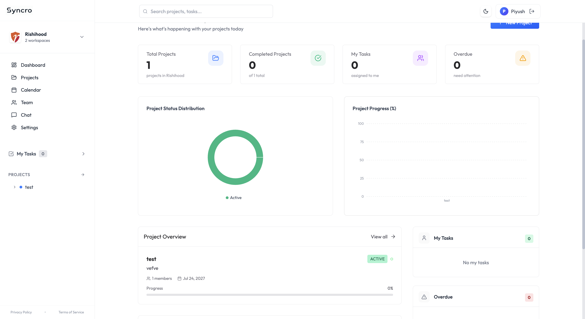
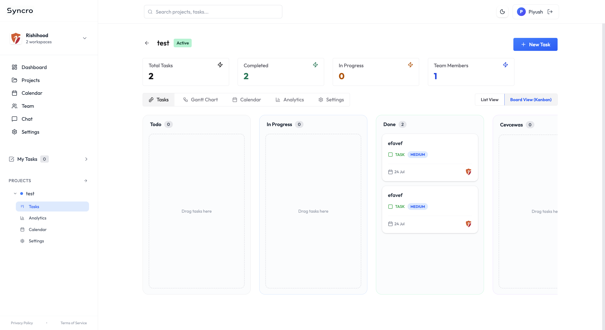
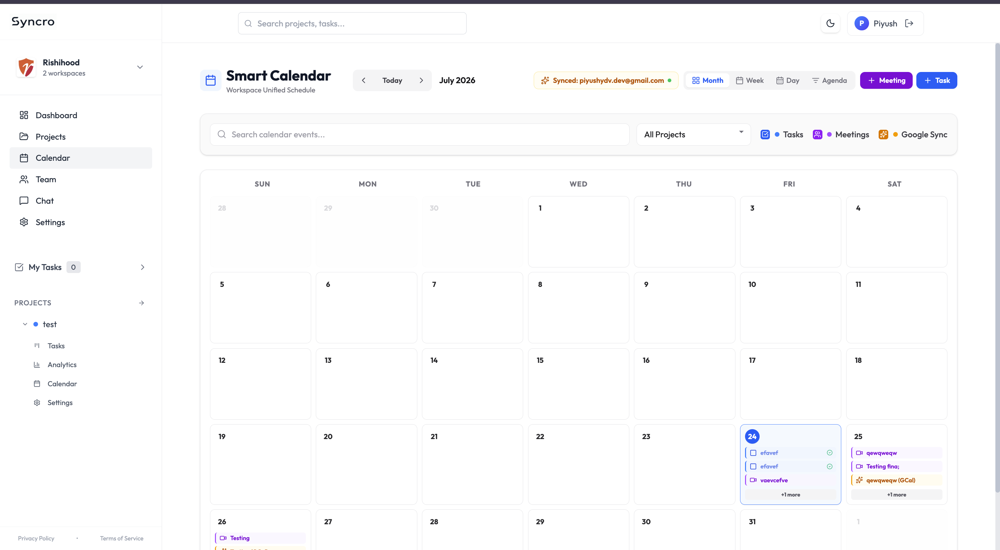
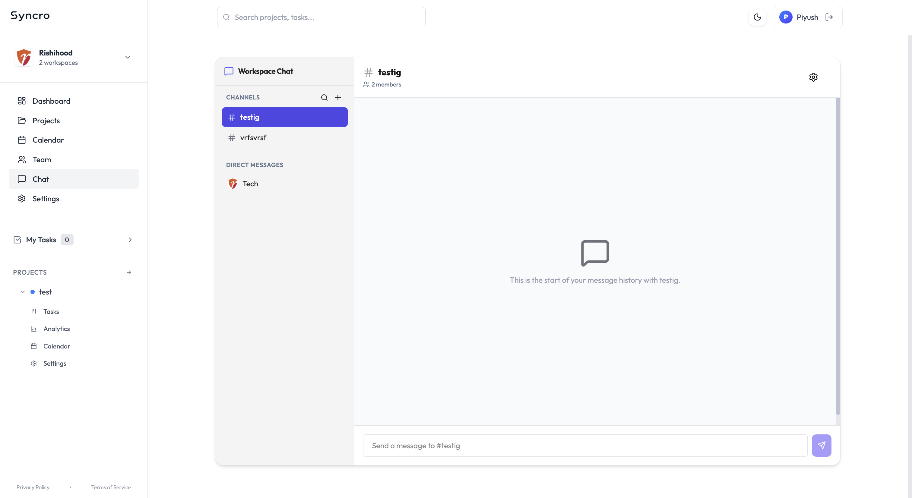
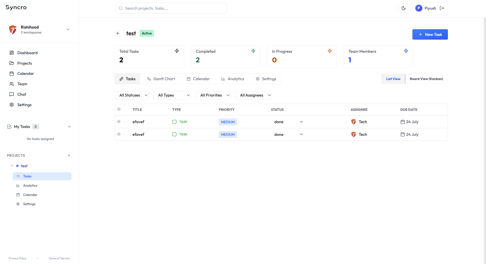

# Syncro Walkthrough

Screenshots below are the same ones shown on the app's own landing page (`client/src/pages/landing/Landing.jsx`), copied here so they render inline on GitHub. See the main [README](../README.md) for the full feature list, [`ARCHITECTURE.md`](../ARCHITECTURE.md) for how each of these is implemented, and [`SECURITY.md`](../SECURITY.md) for the security model.

## Dashboard

Real-time project overview, workspace metrics, and recent team activity.

## Kanban Board

Organize tasks into status columns, drag-and-drop progress, and set priorities.

## Calendar

Unified Smart Calendar showing tasks, meetings, and 2-way Google Calendar events.

## Chat

Real-time team messaging channels, direct messages, and project discussions.

## Task List

Detailed task list view with due dates, assignees, tags, and status tracking.

